# Passport JS proof of concept

## Using Google G-Suite, Azure AD and email / password

### About

This is a proof-of-concept to show how [PassportJS](http://www.passportjs.org/) can be used with [Google's G-Suite](https://gsuite.google.com/) and with [Microsoft's Azure AD](https://azure.microsoft.com/en-us/services/active-directory/) to provide authentication with an [expressjs](https://expressjs.com/) application.

The application uses Passportjs which is awesome and simplifies a lot of the coding.

### Setup

#### For HTTPS over localhost

[Create a self signed certificate](https://ma.ttias.be/how-to-create-a-self-signed-ssl-certificate-with-openssl/) and place in certs folder.

```
openssl req -x509 -sha256 -newkey rsa:2048 -keyout certs/selfsigned.key -out certs/selfsigned.crt -days 1024 -nodes
```

#### Apps

Create Azure AD app (see below).
Create G-Suite SAML app (see below)

(Add downloaded Google cert to certs folder)

#### Local config

Copy .env.template to .env and fill in details.

```
JWT_SIGNATURE=THIS_IS_MY_SUPER_SECRET
TOKEN_EXPIRY=6h
HTTPS=true
PORT=3000
G_SUITE_DOMAIN=example.com
GOOGLE_SSO_URL=https://accounts.google.com/o/saml2/idp?idpid=XXXXXXXX
GOOGLE_ENTITY_ID=https://accounts.google.com/o/saml2?idpid=XXXXXXXX
GOOGLE_CERT_NAME=GoogleIDPCertificate-example.com.pem
AZURE_IDENTITY_METADATA=https://login.microsoftonline.com/XXXXXXX-XXXX-XXXX-XXXX-XXXXXXXX/v2.0/.well-known/openid-configuration
AZURE_CLIENT_ID=XXXXXXXX-XXXX-XXXX-XXXX-XXXXXXXXXXX
AZURE_COOKIE_KEY=12345678901234567890123456789012
AZURE_COOKIE_IV=123456789012
AZURE_CLIENT_SECRET=XXXXXXXXXXXXXXXXXXXXXXXXXXXXX
```

AZURE_IDENTITY_METADATA requires your tenant ID to be inserted into the URL (replacing all the Xs).

JWT_SIGNATURE can be any string.
AZURE_COOKIE_KEY can be any 32 char string.
AZURE_COOKIE_IV can be any 12 char string.

Aside from TOKEN_EXPIRY, HTTPS and PORT, all other values are obtained from G-Suite or Azure AD.

HTTPS should be left as 'true' as Google and Azure expect it.

Run:
```
npm i
```

### Starting the server

```
npm i
node server
```

### Create Azure AD app

Create an Azure account and login.

AD screen provides Tenant ID.

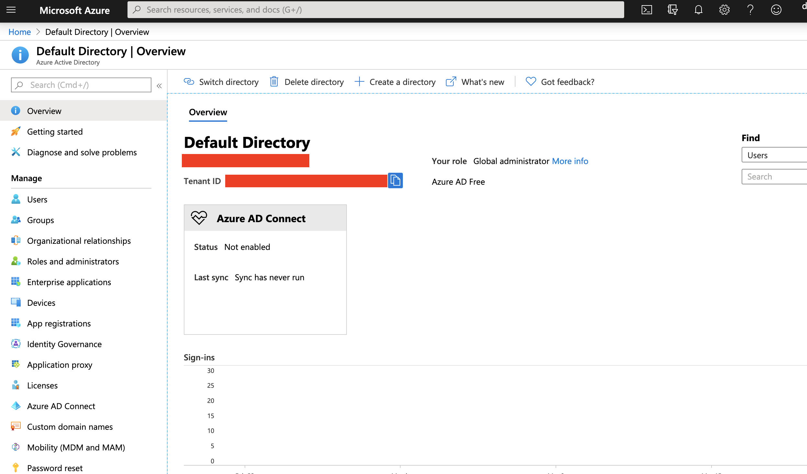

Register an app to obtain client id and secret and to enter callback URL.

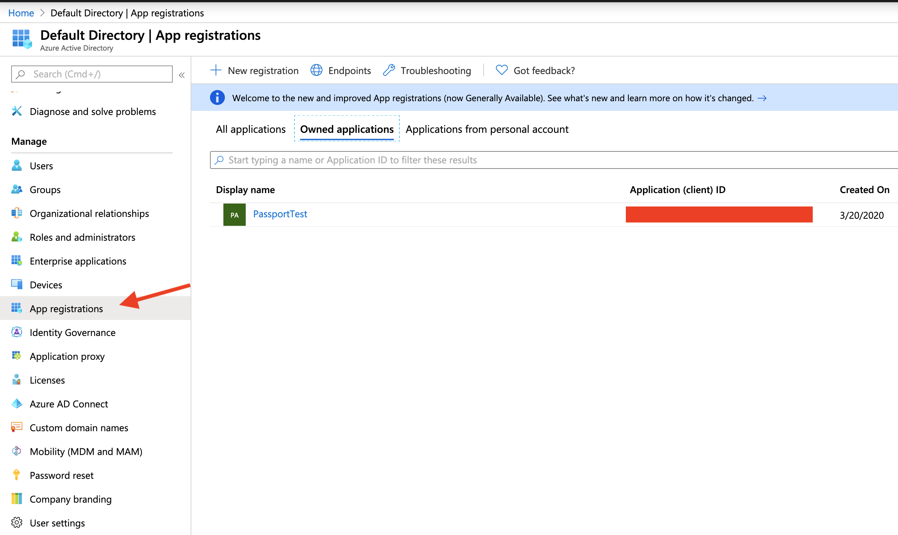

Add platform (web) and add callback URL (in our case https://localhost:3000/azure-callback)

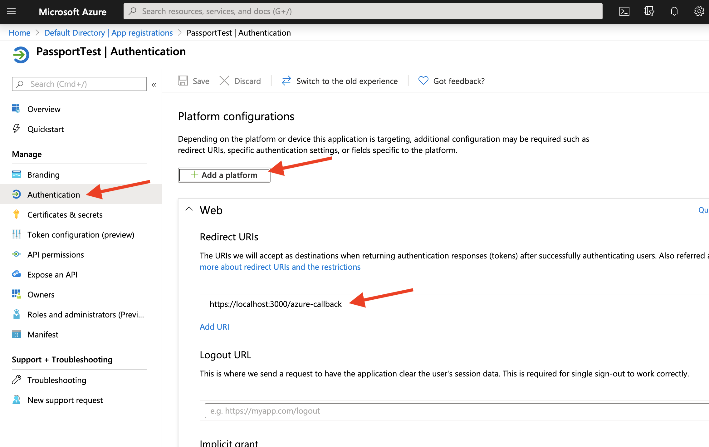

Client ID.

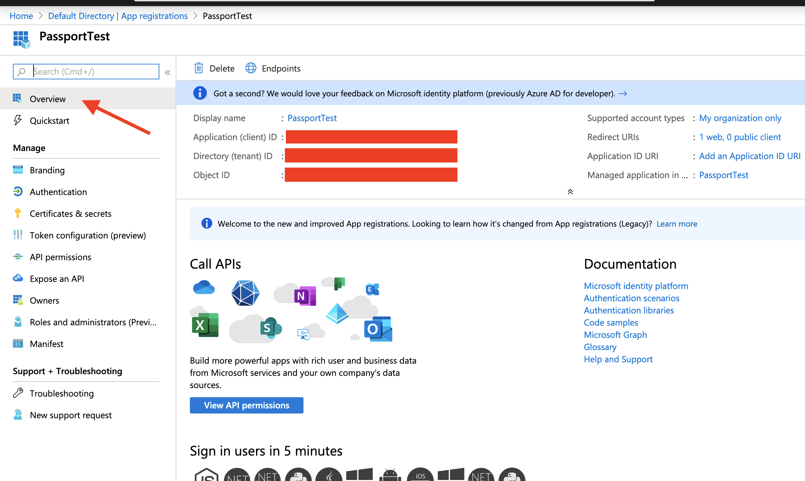

Client Secret.

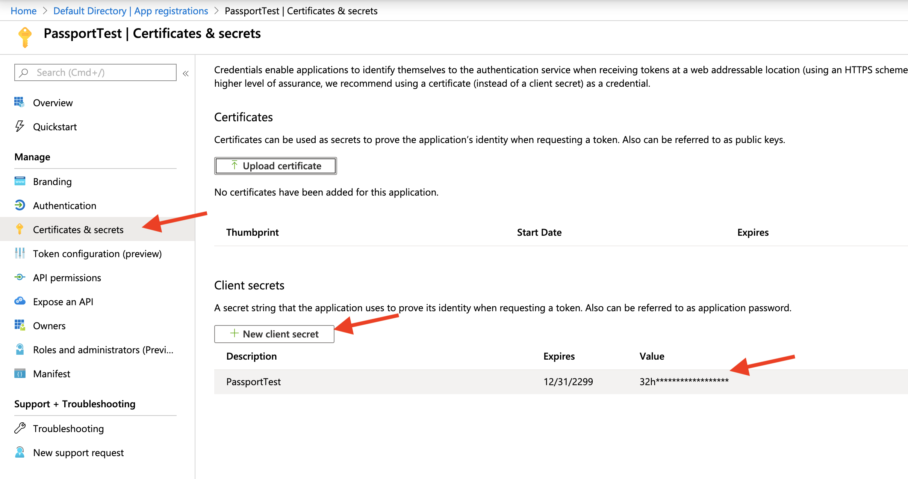

### Create G-Suite SAML app

From Admin, select apps.

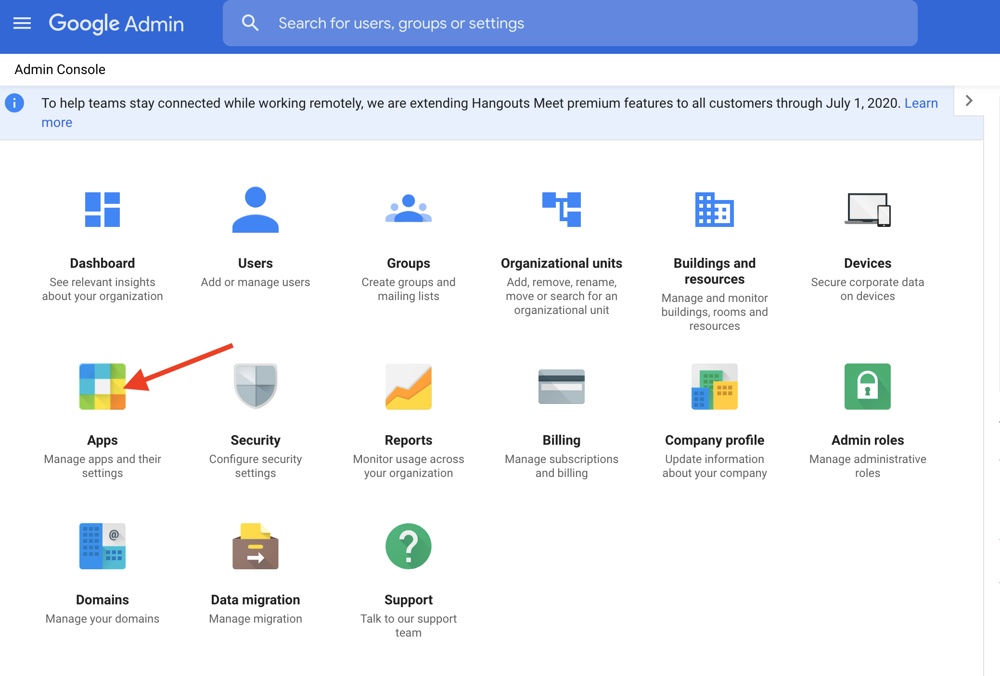

From apps, select SAML apps.

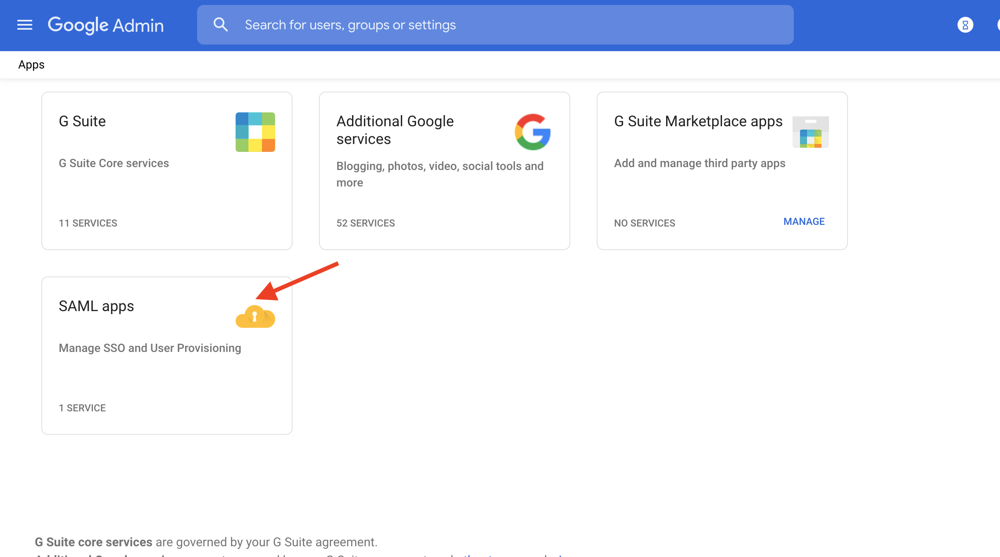

From SAML apps, create a new app (or edit if your app exists)

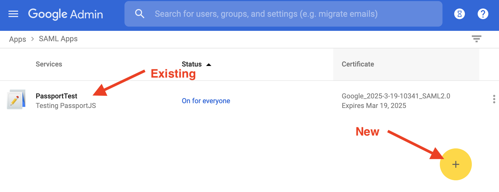

If editing, select service provide details.

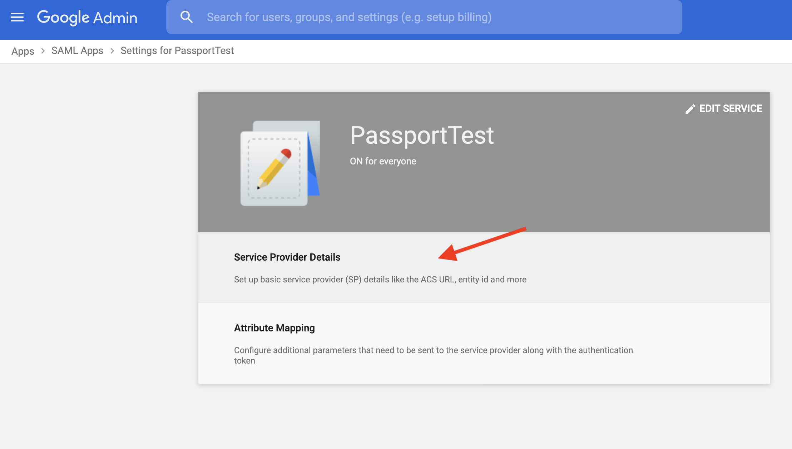

In the Service Provide details, provide your callback URL (in this case https://localhost:3000/saml-callback) and Entity ID (In this case 'PassportTest')

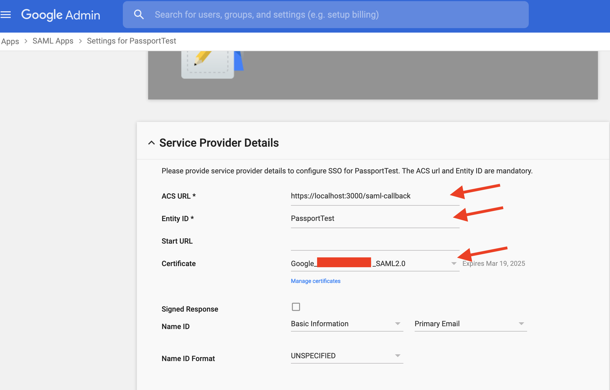

From previous screen, click certifcate. Add the SSO URL and Entity ID to the .env file and download the certificate and add to the certs folder.

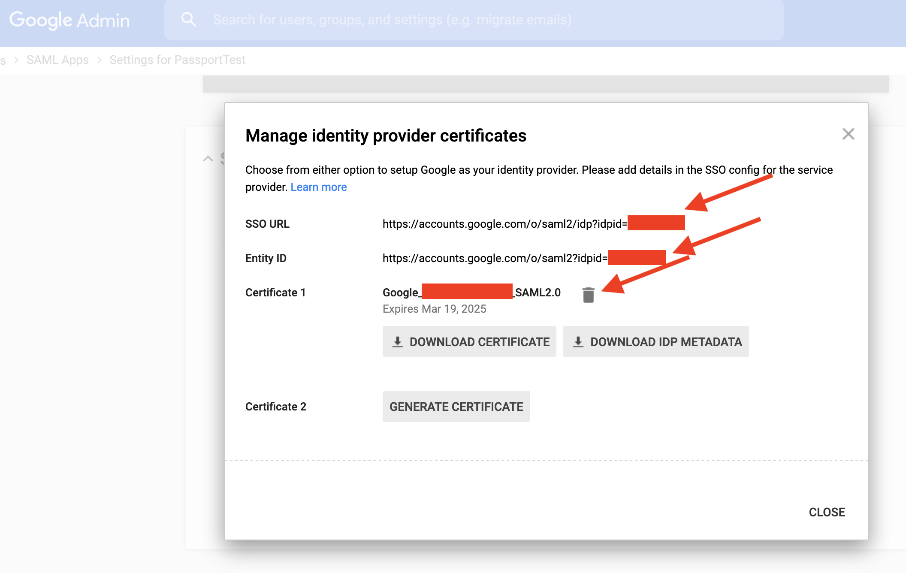
